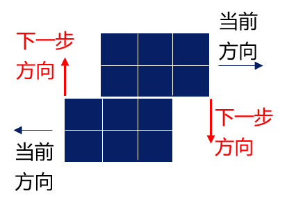

# 教训
**教训**
------

遗憾的是，由于经验不足，第一次编写这种规模的算法，代码管理不当（都编写在几个文件中），也可能由于优化策略编写起来复杂，代码中出现了一些隐秘的bug，难以查出，总是出现一些奇怪的现象，最后还有一个致命问题，是关于船的碰撞。该问题如下。

机器人有两种基本碰撞方式，一种是普通碰撞（下一时间步两机器人移动到同一个点），一种是换位（下一时间步两个机器人交换位置，成环换位可以看作是这一情况的扩展）。原以为船舶只有普通碰撞，没有换位，但是判题器将下面这一情况也看作船舶碰撞：

在海路广阔的地图上没有测试出问题，排查bug时则更多使用自己实现的判题器和碰撞算法，方便调试。然而在复赛正式赛时，海路狭窄，船舶有时会用这个姿势停住很久，导致无法正常工作。

教训是，**编写程序时要模块分明，便于调试**；测试程序时应该尽量在原环境下用极端例子进行测试。

但是考虑到当时时间紧迫且程序都写在一起，要实现后者并不现实，更现实的做法应该是，直接向出题方确认判题机制，也即**在面对存在未知要素的场景时，需要积极地尝试交互进行多次确认**，即使自己觉得已经摸清了机制，但仍要承认存在错误的可能性。

此外，在开始比赛时，队友找到算法之前，本人并没有**搜集信息确定问题所属范畴、寻找已有算法的意识**，意识到这一点也是收获之一。