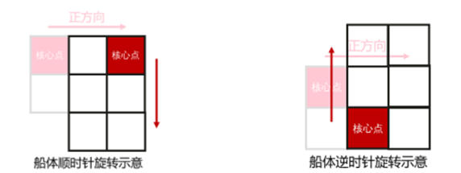
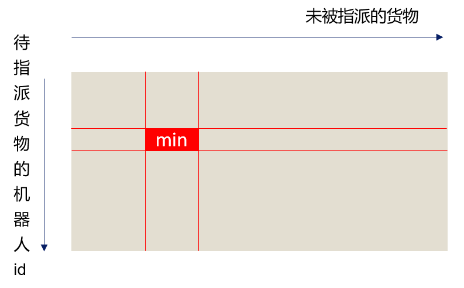
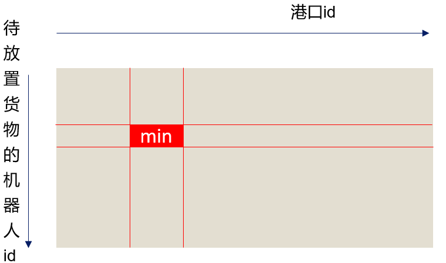
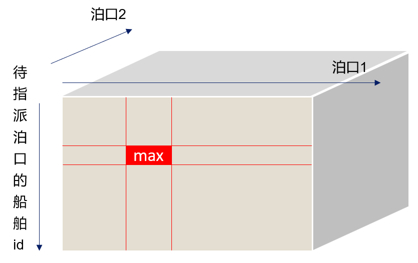
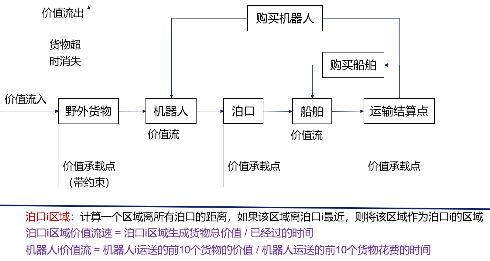

# 策略
**1、多智能体路径规划（MAPF）**
--------------------

这是题目中最重量级的部分。

主要的路径搜索部分采用了pibt算法（Priority Inheritance with Backtracking）。这一算法是队伍中另一位干练的队友找到的，也是他先确定了问题的领域为多智能体路径规划（MAPF）。

pibt算法是一个优先级算法，算法简述如下：给每个待规划机器人赋一个不相同的随机值表示优先级，优先级大的机器人可以让优先级小的机器人给自己“让路”，从而保证优先级大的机器人在被优先级小的机器人挡住时，优先级小的机器人会避开，使得优先级大的机器人能尽量保持原先规划路径，而优先级小的机器人会选择一个对自己最有利的方向避让。当存在2个以上机器人的阻挡问题时，通过递归实现优先级传导，从而能够保证，在一定的问题抽象范畴内，最高优先级的机器人总能行走最优路径，且其余机器人能尽量地选择次优路径。具体内容可以搜寻相关文献。

在这个算法中除了优先级传导和碰撞判断之外，重要的还有搜索图。当机器人遇到比自己优先级高的机器人时需要避开优先级高的机器人的最优路径，这时需要在可避开的位置中找一个离自己目标最近的位置避开，所以机器人不仅需要知道搜索到的最短路径，还需要知道最短路径周围的格子离目标点的距离（以确保在需要“让路”时，能够向一个对自己最有利的方向避让）。

实际策略更加复杂，做了一些修改，且因为用的语言是python，怕运行超时，做了很多优化。

### 1.1 机器人路径规划

**（1）空间上：**  
船舶和机器人都需要规划，所以用一张搜索图同时存储陆路和海路。但是存在海陆两用位置（泊口、桥），对于这些位置的海路再建一些小表来存储。

**（2）时间上：**  
   a、算法：原算法采用从目标点开始进行广度优先搜索的方法实现周围路径的距离记录。考虑到竞赛题目中机器人数量大概10~20个，可以不完全广度优先搜索，而是用一种介于A\*和广度优先搜索之间的搜索方法，每次选取n个离机器人位置期望距离最近的格子进行广度搜索。  
    b、实时性：题目每个时间片都有时间限制，即使改进了算法，有些时间片还是会超时，另一些时间片则可能还有剩余时间。因此采用预搜索的方式，每个时间片一旦有多余时间就进行搜索图的搜索，如果没有搜索完，就让机器人向到目标点直线方向的通路移动。  
    此外，在机器人取货物时，需要建立临时搜索图（因为货物出现的位置是随机的），但是机器人放货物时，泊口的位置是确定的，所以可以建立泊口数量相等的固定搜索图，在机器人要放货物时就把机器人持有的“地图”换成固定搜索图，机器人按地图走就能够最短地到达泊口。

### 1.2 船舶路径规划

对于船舶，路径搜索问题要复杂得多。

**（1）搜索规模问题：**  
    a、船舶有4个方向，自由度有三个：平移、旋转。所以如果正经搜索，每个船舶要建\[nx\]\[ny\]\[4\]的三维表格，确定姿态变换算子进行距离搜索。为了优化搜索速度和存储空间，观察到船舶移动模式中，头部四个格子实际在作纯平移，因此可以降一维，也使用二维图进行搜索，移动时只记录头部方块的左上格，将其看作纯平移，这样可以规划船舶头部左上格精确地到达某个点。

船每次移动时，船头四格方块都会向移动方向平移

  
    b、但是在进行位置判定时，是通过船舶核心点判定的，船舶核心点和船头方块左上格的相对位置关系和姿态有关，需要借助船舶方向信息将方块左上格位置转化到船舶核心点，因此二维搜索并不能确保船舶核心点一定到达目标位置。所以，在船舶左上点和目标位置之间距离靠近时，再建立一个小范围（4X4）的三维搜索图，在这块搜索图中进行精确搜索规划，保证船舶核心点能到达目标点位。  
    c、船舶的行动目标点（泊口、送货点位置）位置是确定的，都可以使用固定搜索图，并利用每个时间片的富余时间更新搜索图（题目给出的初始化时间不足以完成全部搜索）。

**（2）船舶状态问题：**  
由于海路有主航道与非主航道之分，非主航道两个时间步船舶才能行动一次，所以将用于船舶的pibt算法也修改为了两步预测碰撞。当优先级传导、预判船舶避让时，得预先多个时间步判断（因为下一个时间步船舶可能因为正处于停止状态而无法让道，单个时间步无法保证及时让道，也就不能保证优先级最高的船舶走的是最优路径，只有预判两个时间步才能保证）。

**2、机器人选择货物和泊口**
----------------

### 2.1 机器人选择货物

在其它策略方面，采用一些简单有效的指标，譬如机器人选择货物方面，同时考虑机器人这次取货物以及下次放置货物，计算：（货物i与机器人j的估计距离+货物i与最近泊口的距离）/货物i价值。每次选出该值最小的（机器人，货物）二元组，把货物分配给该机器人，然后用剩下的机器人和货物继续该计算。

考虑到货物的过期时间等影响因素，在实际计算中设置了一些和货物剩余时间相关的超参数，供后期调整。

### 2.2 机器人放置货物

在机器人选择货物时，貌似已经考虑了应当放在哪个泊口（离货物最近的泊口），但实际上机器人放完货物后仍要再次取货，所以采取相似的方式，同时考虑机器人这次放置货物和下次取货物，计算：（机器人j离泊口i的距离+离泊口i最近的货物的距离）/离泊口i最近的货物的价值。每次选出该值最小的（机器人，泊口）二元组，让机器人在对应泊口放置货物，然后用剩下的机器人继续该计算。

### 2.3 策略改进

但是这样的策略存在一些问题。其中一个比较明显的问题是：机器人会选择较近的货物，而其它位置可能有货物堆积，当别的地方货物堆积得比较多，而当前位置有价值的货物都被清空后，机器人就会倾向于聚集过去，而当前位置又开始堆积货物。机器人像蝗虫一样聚集行动拿取货物，降低了整体效率。

为了应对这一问题，给地图每个区域都分配了tag，如果某个区域离当前泊口更近，就将其tag设置为当前泊口id，这样把地图按泊口划分成几个区域，而每当有机器人在某个泊口放货物，就把机器人的当前工作泊口设置为这个泊口，机器人更倾向于把货物放在它的工作泊口，而一个泊口如果有太多工作的机器人，它就会清理掉一些机器人，让这些机器人倾向于去找别的泊口放置货物。当然，除了有工位的机器人，还有一些余数作为流浪机器人，流浪机器人没有固定工位，除非这个工位有机器人离开，流浪机器人就会替补上去，而离开的机器人就成为新的流浪机器人。这样可以实现机器人较好的分散性。实际实现还包括泊口区域内货物的分配方式，相对复杂不具体说明。

**3、船舶选择取货点**
-------------

由于船舶资源更为稀缺，移动花费的时间造成的滞后效应也更大，为了保证实时性，在规划时除了规划船舶下一步要去往的泊口，还要前瞻一步泊口。

计算：船可获取的泊口堆积货物价值/船一趟时间，船一趟时间包括：当前已经花费时间+前往泊口1并取货+前往泊口2并取货+回航时间，选择最大值指派船舶到泊口。但对于回航的判断会更特殊一些。

**4、其它策略**
----------

竞赛时，还分析了价值的流向，想通过统计信息来确定是哪个位置阻塞了价值流动，决定何时购买船舶、何时购买机器人，见下图。但实现后效果较差，可能是因为采样较少，或是实现时存在bug，仅供参考。

